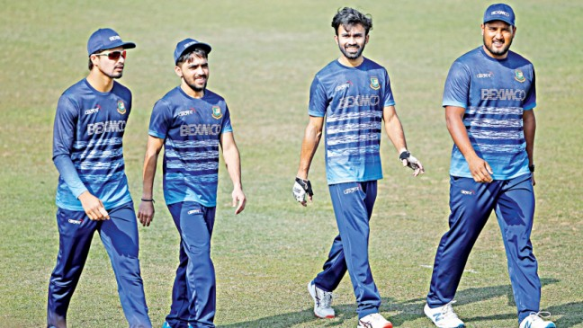

## Batting changes not yet bearing fruit
The buzzword in the Bangladesh camp before returning to international cricket after over 10 
months with the ODI series against the West Indies was long-term planning keeping the 2023 
ICC World Cup in mind.

The team management did try some tactical changes such as promoting young left-hander Nazmul 
Hossain Shanto to number three in place of Shakib Al Hasan, who had made the position his own 
during the 2019 ICC World Cup.

